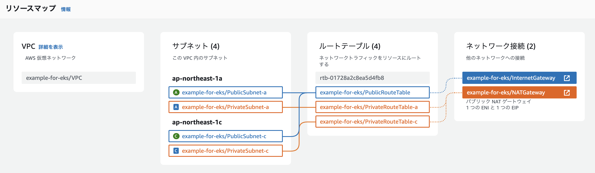

# EKS 練習用の VPC & 関連リソース 作成
このTerraformプロジェクトは、EKSクラスターを作成する際に使用するVPCおよび関連リソースをあらかじめ作成するためのものです。学習用に設計されていますので、EKS環境を試す際にご利用ください。


## 作成されるもの


| 名前                          | サブネットのタイプ     | AZ                | CIDRブロック      | IPアドレス範囲                | IPアドレス数 |
|------------------------------|-----------------------|-------------------|-------------------|------------------------------|--------------|
| example-for-eks/PublicSubnet-a | パブリックサブネット   | ap-northeast-1a   | 172.20.0.0/19     | 172.20.0.0 - 172.20.31.255    | 8,192        |
| example-for-eks/PrivateSubnet-a | プライベートサブネット | ap-northeast-1a   | 172.20.96.0/19    | 172.20.96.0 - 172.20.127.255  | 8,192        |
| example-for-eks/PublicSubnet-c | パブリックサブネット   | ap-northeast-1c   | 172.20.32.0/19    | 172.20.32.0 - 172.20.63.255   | 8,192        |
| example-for-eks/PrivateSubnet-c | プライベートサブネット | ap-northeast-1c   | 172.20.128.0/19   | 172.20.128.0 - 172.20.159.255 | 8,192        |

上記に加えて、以下の SecurityGroup(sg) が作成されます。

- Kubernetes の Node に設定するための sg
  - Node 同士の通信を許可
- Kubernetes の Node から RDS(3306) を許可するための sg
  - Node --> RDS を許可する（RDS設定用）


### AWS の料金
ここで作成されるほとんどのリソースは作成するだけでは料金が発生しませんが、NAT Gateway 作成すると時間単位で料金が発生します。  
1日に 1.488 USD (= 0.062 USD * 24 h) 発生するので気をつけてください。 (*1)

他にも通信量によって課金されるリソースもあります。詳しくは以下を確認してください。

[料金 - Amazon VPC | AWS](https://aws.amazon.com/jp/vpc/pricing/)


*1) アジアパシフィック（東京）で計算しています(2024/08/23現在)


## 初期設定
### Terraform 初期化
Terraformの初期化を行います。
```sh
terraform init
```

### AWSプロファイルを指定
特定のAWSプロファイルを使用する場合は、以下のように環境変数`AWS_PROFILE`を指定してコマンドを実行してください。

```sh
AWS_PROFILE=admin terraform apply
```
同様に、`plan` や `destroy` の際も `AWS_PROFILE=admin` を付けて実行できます。


毎回指定するのが面倒な場合は、以下で環境変数を設定してください。
```sh
export AWS_PROFILE=admin
```
適宜設定してください

## 操作
### 設定の確認
リソースの作成前に、どのような変更が行われるかを確認できます。
```sh
terraform plan
```

各リソースの接頭辞を変更したい場合は以下のようにします。
```sh
terraform plan -var='project_name=sample'
```

### リソースの作成
以下のコマンドでリソースを作成します。

```sh
terraform apply
```

`terraform plan` と同様で `-var` を指定することで接頭辞を変更できます。
```sh
terraform apply -var='project_name=sample'
```

### リソースの削除
作成したリソースを削除するには、次のコマンドを使用します。

```sh
terraform destroy
```


## 実行例
```
❯ terraform apply

Terraform used the selected providers to generate the following execution plan. Resource actions are indicated
with the following symbols:
  + create

...省略

Apply complete! Resources: 17 added, 0 changed, 0 destroyed.

Outputs:

gateways = {
  "igw" = {
    "id" = "igw-0e09fb45dedc3a126"
  }
}
route_tables = {
  "private" = {
    "a" = {
      "id" = "rtb-04a2e0e6dd6a92168"
    }
    "c" = {
      "id" = "rtb-0fe08107a9c3be6eb"
    }
  }
  "public" = {
    "id" = "rtb-0da58dc98663f4479"
  }
}
security-groups = {
  "cluster_shared_node" = {
    "id" = "sg-0a6dacbdfae209ac8"
  }
  "rds" = {
    "id" = "sg-04c97c6449e64fbba"
  }
}
subnet = {
  "private" = {
    "a" = "subnet-0de55cf0df0ae4295"
    "c" = "subnet-0786d5b3b458d920f"
  }
  "public" = {
    "a" = "subnet-0bb7ae5ee942c10b9"
    "c" = "subnet-0090d67194167d356"
  }
}
vpc_id = "vpc-083a8213a651eea17"
```


上記の実行結果を、 [eksctl](https://eksctl.io/usage/creating-and-managing-clusters/) で利用する `cluster.yaml ` に指定した例
```yaml
apiVersion: eksctl.io/v1alpha5
kind: ClusterConfig
metadata:
  name: eks-example
  region: ap-northeast-1
  version: "1.30"
vpc:
  subnets:
    private:
      ap-northeast-a:
        id: subnet-0de55cf0df0ae4295
      ap-northeast-c:
        id: subnet-0786d5b3b458d920f
    public:
      ap-northeast-a: 
        id: subnet-0bb7ae5ee942c10b9
      ap-northeast-c:
        id: subnet-0090d67194167d356
  sharedNodeSecurityGroup: sg-0a6dacbdfae209ac8
nodeGroups:
  - name: workers
    instanceType: t3.medium
    minSize: 2
    maxSize: 2
    desiredCapacity: 2
```

## LICENSE
MIT

